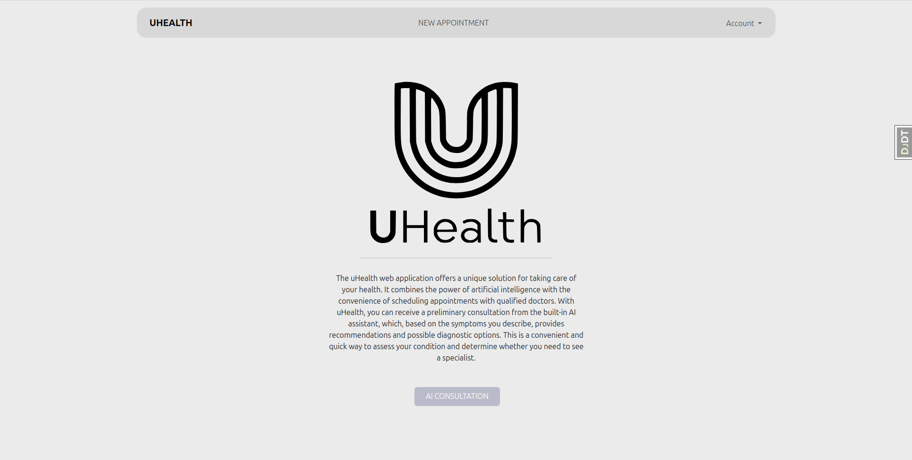
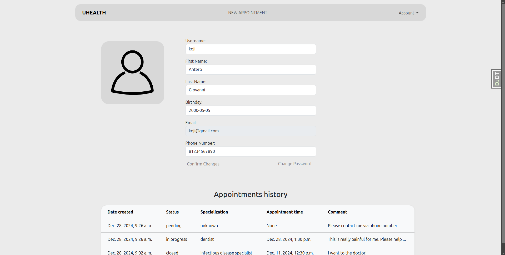
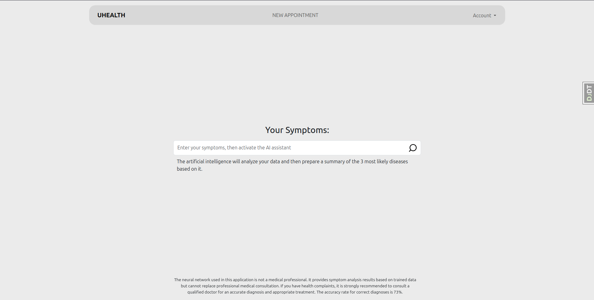
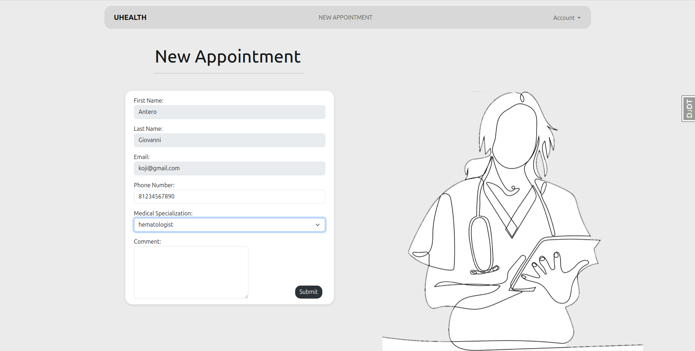

# uHealth

**uHealth** is a Django-based web application that leverages artificial intelligence to assist users in identifying potential medical conditions based on their symptoms and helps them schedule appointments with the appropriate specialists.




---

## Features

### AI-Powered Diagnosis
- Input your symptoms into the application.
- The AI, trained on a openAI gpt4-o model, provides up to **three possible diagnoses** or an error message if the input is insufficient.
- Each diagnosis is accompanied by a **detailed explanation (approximately 100 words)** about the condition.
- At the end of each explanation, the AI recommends the type of specialist to consult.


---

### Appointment Scheduling
- Users with an account can:
  - **Book an appointment** with a doctor based on the AI's recommendation.
  - **Choose the specialization** of the doctor for the appointment.
- A history of all appointments is stored in the user's profile for future reference.


---

## Installation

1. Clone the repository:
   ```bash
   git clone https://github.com/Koji255/uHealth.git
   cd uHealth
   ```
2. Install the required dependencies:
   ```bash
   pip install -r requirements.txt
   ```
3. Set up variables in `/backend/settings.py` and `/diagnosise/utils/ai_request.py`
4. Apply migrations:
   ```bash
   python manage.py migrate
   ```
5. Start the development server:
   ```bash
   python manage.py runserver
   ```

---

## Usage
1. Visit the application in your browser at `http://127.0.0.1:8000/`.
2. Register for an account or log in if you already have one.
3. Enter your symptoms on the ai-consultation page.
4. Review the diagnoses and details provided by the AI.
5. Book an appointment with a doctor if needed.

---

## Technologies Used
- **Backend**: Django, Django Rest Framework (DRF)
- **AI Model**: OpenAI GPT4-o
- **Database**: PostgreSQL (can be replaced with other databases)

---

## Future Enhancements
- Integration with external APIs for real-time medical data.
- Adding more languages for better accessibility.
- Enhanced AI model for higher diagnostic accuracy.

---

## Contributing
Contributions are welcome! Please fork the repository and create a pull request with your proposed changes.

---

## License
This project is licensed under the [MIT License](LICENSE).

---

## Acknowledgements
Special thanks to contributors and open-source libraries that made this project possible.
